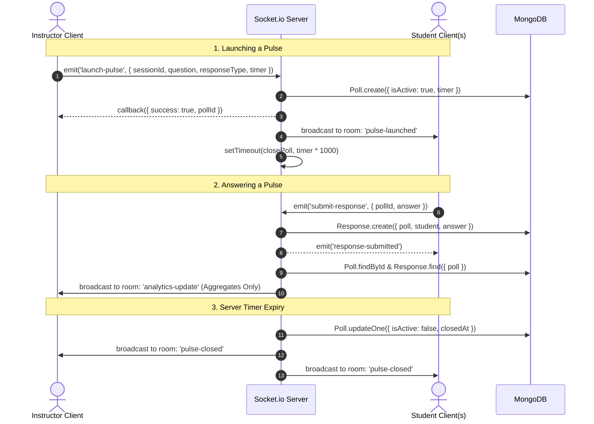

# PulseClass — System Architecture & Technical Design

## 1. System Overview

PulseClass is architected as a real-time, event-driven web application featuring a decoupled React single-page frontend and a Node.js/Express backend paired with Socket.io and MongoDB.

```
┌─────────────────────────────────────────────────────────────┐
│                    CLIENT LAYER (SPA)                       │
│  React 19 · Vite · Tailwind CSS · React Router v7          │
│  Context API (AuthContext, SocketContext, ToastContext)     │
│  Custom Hooks (useKeyboardShortcuts)                        │
└──────────────────────────────┬──────────────────────────────┘
                               │
               ┌───────────────┴───────────────┐
               │                               │
        REST API (HTTP)                WebSocket (WSS)
        - Auth & Session CRUD          - Real-Time Events
        - Institute & Classroom        - Live Distribution
        - Analytics Reports            - Timers & Broadcasts
               │                               │
┌──────────────┴───────────────────────────────┴──────────────┐
│                    SERVER LAYER (Node.js)                   │
│  Express 4 · Socket.io 4 · Helmet · CORS · Rate Limiter     │
│  Zod Schema Validation · JWT in httpOnly Cookies            │
│  Role-Based Access Control (RBAC: instructor | student)     │
│  Server-Authoritative Timer Manager (activeTimers map)       │
└──────────────────────────────┬──────────────────────────────┘
                               │ Mongoose ODM
┌──────────────────────────────┴──────────────────────────────┐
│                    DATA LAYER (MongoDB)                     │
│  Collections: Users, Institutes, Classrooms,               │
│               Sessions, Polls, Responses                    │
│  Compound Unique Indexing for Defense-in-Depth Deduplication│
└─────────────────────────────────────────────────────────────┘
```

---

## 2. Real-Time WebSocket Architecture

### 2.1 Room Topology
Each active session maps to a dedicated Socket.io room:
- Room naming pattern: `session:{sessionId}`
- Only authenticated users enrolled in the institute and classroom are permitted to join the room.
- Socket authentication occurs during the initial handshake via parsed `httpOnly` JWT cookies (with handshake auth fallback).

### 2.2 Event Contract



### 2.3 Server-Authoritative Timer Architecture
- Timers are controlled entirely by the server. Clients display a smooth, countdown animation for UX, but voting validity is governed by the backend.
- A Node.js `Map` (`activeTimers: Map<pollId, TimeoutId>`) manages countdown references.
- When an instructor launches a new pulse while an existing one is running, the previous pulse is automatically closed, and its timer cancelled, ensuring clean state transitions.

---

## 3. Database Schema & Data Models

```
User
  ├── _id: ObjectId
  ├── name: String
  ├── email: String (unique)
  ├── passwordHash: String (bcrypt)
  ├── role: enum ['instructor', 'student']
  └── institutes: [ObjectId -> Institute]

Institute
  ├── _id: ObjectId
  ├── name: String
  ├── code: String (unique, 6-8 chars uppercase)
  ├── owner: ObjectId -> User
  └── members: [ObjectId -> User]

Classroom
  ├── _id: ObjectId
  ├── name: String
  ├── institute: ObjectId -> Institute
  ├── instructor: ObjectId -> User
  ├── students: [ObjectId -> User]
  └── activeSession: ObjectId -> Session (nullable)

Session
  ├── _id: ObjectId
  ├── classroom: ObjectId -> Classroom
  ├── instructor: ObjectId -> User
  ├── participants: [ObjectId -> User]
  ├── isActive: Boolean
  ├── startedAt: Date
  └── endedAt: Date (nullable)

Poll
  ├── _id: ObjectId
  ├── session: ObjectId -> Session
  ├── question: String
  ├── category: enum ['understanding', 'pace', 'revision', 'doubt', 'feedback', 'custom']
  ├── responseType: enum ['yesno', 'rating', 'choice']
  ├── options: [String]
  ├── timer: Number (3-120 seconds)
  ├── isAnonymous: Boolean
  ├── isActive: Boolean
  ├── launchedAt: Date
  └── closedAt: Date (nullable)

Response
  ├── _id: ObjectId
  ├── poll: ObjectId -> Poll
  ├── student: ObjectId -> User
  ├── answer: String
  └── submittedAt: Date
```

### 3.1 Database Indexes & Constraints
1. `User`: `{ email: 1 }` (unique)
2. `Institute`: `{ code: 1 }` (unique), `{ owner: 1 }`
3. `Classroom`: `{ institute: 1 }`, `{ instructor: 1 }`
4. `Session`: `{ classroom: 1, isActive: 1 }`, `{ instructor: 1 }`
5. `Poll`: `{ session: 1 }`, `{ session: 1, isActive: 1 }`
6. `Response`:
   - `{ poll: 1, student: 1 }` (unique compound index) → Guarantees at the database level that no student can ever submit more than one response per poll.
   - `{ poll: 1 }` → Fast response lookups for real-time aggregate calculation.

---

## 4. Privacy & Anonymity Design

1. **Separation of Student Identity from Aggregate Payload**:
   - The backend records `student: socket.user._id` in the `Response` model strictly to enforce duplicate prevention and participant accounting.
   - When emitting `analytics-update` and `pulse-closed` to the room, the backend invokes `calculateDistribution(poll, responses)`, mapping answers into aggregated key-value counts (`{ "Yes": 32, "No": 4 }` or `{ "1": 2, "2": 5, ... }`).
   - Student IDs, names, and IP addresses are **never** included in WebSocket broadcasts or session report endpoints.

2. **Defense-in-Depth Voting Validation**:
   - Level 1: Client UI disables response buttons and shows "Response submitted" immediately upon tapping.
   - Level 2: Socket event handler checks `Response.findOne({ poll: pollId, student: socket.user._id })` before creation.
   - Level 3: MongoDB compound unique index `{ poll: 1, student: 1 }` catches concurrent race conditions (E11000 duplicate key error).

---

## 5. Security & Hardening Measures

- **JWT Authentication in httpOnly Cookies**: Tokens cannot be accessed via JavaScript (`document.cookie`), neutralizing Cross-Site Scripting (XSS) token theft.
- **Strict SameSite & Secure Cookies**: Configured with `sameSite: 'lax'` in development and `'strict'` with `secure: true` in production.
- **Helmet**: Secures HTTP response headers against clickjacking, MIME-sniffing, and cross-site scripting.
- **Express Rate Limiting**:
  - Global API: 100 requests per 15 minutes per IP.
  - Auth Endpoints: 20 requests per 15 minutes per IP to prevent credential brute-forcing.
- **Zod Input Validation**: Strongly typed schemas validate all request bodies before hitting controllers.
- **Role-Based Authorization Middleware**: Enforces least privilege (`authorize('instructor')` vs `authorize('student')`).

---

## 6. Horizontal Scaling & High Availability

For production deployments serving thousands of concurrent classrooms:
1. **Socket.io Redis Adapter**: Replace in-memory Socket.io adapter with `@socket.io/redis-adapter` to distribute rooms across multiple Node.js instances behind an Nginx or ALB reverse proxy with sticky sessions.
2. **MongoDB Replica Set**: Master-replica architecture with read preference `secondaryPreferred` for analytical reporting queries (`getSessionReport`).
3. **Stateless App Tier**: All session timers and states reside in MongoDB or distributed cache (Redis Key Expiration / BullMQ), allowing application containers to restart with zero state loss.
